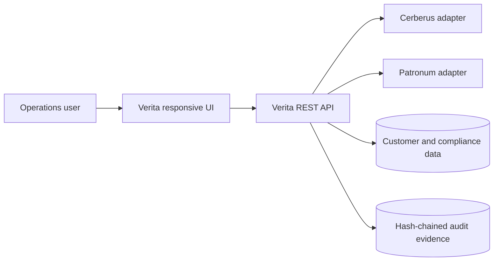

# Verita Architecture Notes

## 1. Scope

Verita replaces five fragmented legacy onboarding applications with one coherent workflow for France and Australia. The working MVP demonstrates the core business path while keeping enterprise integrations behind adapters.

## 2. TOGAF Layer Mapping

### Business architecture

- Unified FR/AU onboarding process
- Straight-through processing for standard cases
- Human validation for sensitive cases
- Compliance lead decision queue
- Operational KPIs: activation time, automation rate, data quality and active cases

### Data architecture

- Customer domain: identity, contact, residency and consent
- Compliance domain: evidence, AI assessments and decisions
- Contract domain: service address and activation status
- Golden customer record stored in SQLite for the MVP
- Immutable SHA-256 hash chain for audit evidence

### Application architecture

### Technology architecture

The local MVP uses Python 3.12, a zero-dependency threaded HTTP server and SQLite. The production target maps to Azure:

| MVP component | Azure target |
| --- | --- |
| Python REST API | Azure Container Apps or App Service |
| SQLite database | Azure SQL Database or PostgreSQL Flexible Server |
| Simulated evidence upload | Blob Storage with encryption and malware scanning |
| Cerberus adapter | Okta SAML 2.0 federation |
| Patronum adapter | Private audited AI gateway |
| Console logs | Application Insights and Log Analytics |
| Local HTTP | TLS gateway, WAF and private network controls |

## 3. Patronum Control Model

Patronum supports decisions but does not make irreversible high-risk decisions. It receives structured customer details and document evidence, then returns:

- confidence score
- risk level
- recommendation
- explainable reasons
- model version

Low-risk standard cases may be auto-approved. Medium- and high-risk cases enter the human review queue. Every AI assessment and human decision is recorded in the audit chain.

## 4. Security

- Cerberus adapter separates authentication from application logic.
- API endpoints require bearer tokens except health check and login.
- Static paths are resolved and checked to block directory traversal.
- Request bodies have a maximum size.
- Security headers prevent MIME sniffing and framing.
- Audit evidence is linked with SHA-256 hashes.
- Production deployment adds TLS, secret management, least-privilege roles and private networking.

## 5. Responsive UI

The UI includes tested breakpoints:

- Desktop: four KPI cards, persistent left navigation and two-column analytics.
- Tablet: compact left navigation, two KPI columns and stacked analytics.
- Mobile or high zoom: fixed bottom navigation, one-column KPI layout below 430 px, scroll-contained tables and screen-bounded modal dialogs.

Verified viewport sizes: `1440x900`, `820x900`, `390x844`, `640x720` and `1280x600`.

## 6. Legacy Transition

1. Shadow mode: synchronize legacy records into Verita and compare outcomes.
2. Pilot: onboard a limited FR cohort and validate reconciliation.
3. AU rollout: enable country rules and operational training.
4. Progressive migration: move golden records and archive evidence.
5. Retirement: lock legacy writes, retain read-only access and decommission applications.
