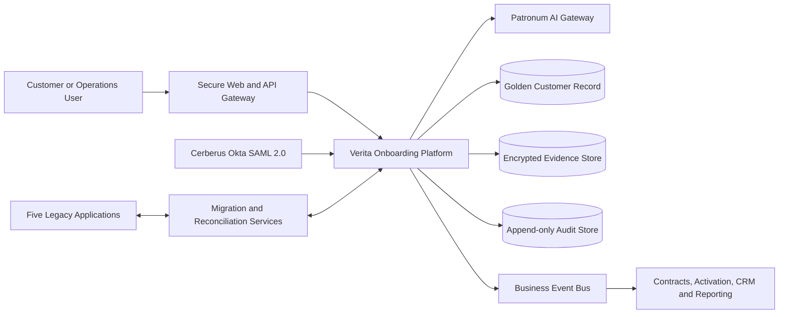
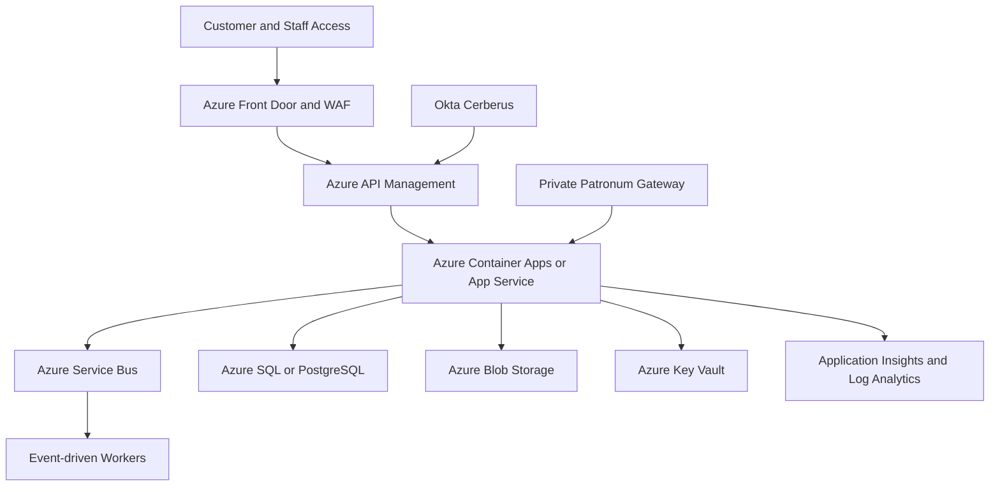

# Verita
## Architecture Board Report

**Customer Onboarding and KYC Modernization for Beauxbatons Energy Retail**  
**Markets:** France and Australia  
**Prepared for:** Architecture Board, CDIO, CTO and CISO  
**Version:** 1.0  
**Date:** 1 June 2026

---

## Executive Summary

Beauxbatons currently operates five disconnected customer onboarding applications across France and Australia. The process depends on manual activities, spreadsheets and fragmented data stores. This increases onboarding time, weakens cybersecurity controls, complicates regulatory compliance and creates avoidable operating costs.

This report proposes **Verita**, a unified cloud-native onboarding and KYC platform. Verita provides one controlled workflow for customer intake, evidence handling, compliance validation, human review and service activation. It integrates:

- **Cerberus**, the Okta-based identity guardian using SAML 2.0;
- **Patronum**, the existing AI capability extended to support explainable KYC and compliance checks;
- Azure-managed platform services for secure, observable and scalable operations;
- a governed golden customer record for France and Australia.

The target design supports approximately **150,000 onboarding cases per year**. Standard low-risk cases are processed automatically. Sensitive cases are routed to compliance teams through a human-in-the-loop review queue. Patronum provides decision support, but does not autonomously make irreversible high-risk compliance decisions.

The working software prototype delivered with this report demonstrates the core design. It includes a responsive user interface, a REST API, persistent data storage, simulated Cerberus login, explainable Patronum risk assessment, manual review, governance views and hash-chained audit evidence.

The recommended program duration is **15 months**. Indicative implementation investment is **EUR 2.35 million**, with steady-state annual benefits of **EUR 1.63 million** and annual recurring costs of **EUR 620,000**. The estimated steady-state net benefit is **EUR 1.01 million per year**, producing a payback period of approximately **2.3 years** after rollout.

---

## 1. Decision Requested

The Architecture Board is requested to:

1. Approve Verita as the strategic onboarding and KYC platform for France and Australia.
2. Approve the Azure cloud-native target architecture and security principles.
3. Approve the controlled use of Patronum for explainable KYC decision support.
4. Approve the phased migration and retirement of the five legacy applications.
5. Authorize a 15-month delivery program with formal stage gates after pilot, migration rehearsal and production rollout.

---

## 2. Context and Assumptions

### 2.1 Business Context

The current environment is maintained by multiple teams and includes five independent applications, spreadsheets and manual activities. It no longer scales effectively and does not provide an authoritative customer record. The organization requires a modern platform that reduces total cost of ownership, increases collaboration, strengthens governance and creates a more trustworthy customer experience.

### 2.2 Key Assumptions

Where the source brief does not provide a value, this report records an explicit assumption:

| Area | Assumption |
| --- | --- |
| Naming | The brief refers once to a landscape centered on “Aquila”. This report treats that as a naming inconsistency and uses **Verita** consistently as the target onboarding platform. |
| Volume | 150,000 cases per year corresponds to approximately 12,500 cases per month and an average of 411 cases per day. The platform is sized for peaks of 10 times the daily average. |
| Availability | Customer onboarding is important but does not require active-active global operation. A 99.9% monthly availability target is proportionate for the initial release. |
| Cerberus | Cerberus is an existing Okta instance capable of SAML 2.0 federation, role mapping and multi-factor authentication. |
| Patronum | Patronum is an existing AI service. Its internal implementation is outside this project scope, but its integration contract, governance and control model are in scope. |
| Regulatory controls | France requires GDPR-aligned privacy controls. Australia requires Privacy Act-aligned controls. Retention rules are approved by Legal and Compliance before go-live. |
| Legacy ownership | Nick remains accountable for the legacy perimeter during transition and becomes a subject-matter expert for migration and retirement activities. |
| Currency | Budget values are indicative and expressed in EUR excluding tax. |

---

## 3. Architecture Principles

The proposal is guided by the following principles:

1. **One onboarding capability:** France and Australia use one core product with configurable country rules.
2. **API-first and event-driven:** Business capabilities communicate through versioned APIs and events rather than direct database coupling.
3. **Zero Trust:** Every access request is authenticated, authorized, logged and continuously assessed.
4. **Human accountability:** AI supports compliance decisions but does not replace accountable human judgment in sensitive cases.
5. **Golden customer record:** Customer data is governed, traceable and reconciled across the lifecycle.
6. **Cloud-native elasticity:** Components scale independently and consume resources only when required.
7. **Evidence by design:** Auditability, explainability and regulatory evidence are designed into the platform.
8. **Progressive retirement:** Legacy systems are decommissioned only after migration, reconciliation and operational readiness are proven.

---

## 4. Business Architecture

### 4.1 As-Is Process

The existing onboarding process is fragmented across five applications and manual spreadsheets. Similar work is repeated by different teams. Data is re-entered, ownership is unclear and audit evidence is difficult to assemble.

#### As-Is SIPOC

| Suppliers | Inputs | Process | Outputs | Customers |
| --- | --- | --- | --- | --- |
| Customer, sales teams, country operations, legacy administrators | Customer details, identity documents, address evidence, contract information | Manual intake, repeated entry, spreadsheet tracking, fragmented KYC checks, email-based clarification, manual activation | Inconsistent customer records, delayed activation, dispersed compliance evidence | Customers, FR and AU operations, compliance, audit, marketing |

### 4.2 To-Be Process

Verita provides a single intake and orchestration journey:

1. The user authenticates through Cerberus.
2. Verita captures customer and contract information once.
3. Evidence is uploaded securely, scanned and encrypted.
4. Patronum extracts fields, detects anomalies and returns an explainable confidence score.
5. Standard low-risk cases are activated automatically.
6. Medium- and high-risk cases enter a compliance review queue.
7. Human decisions and AI evidence are recorded in immutable audit logs.
8. The golden customer record is published to downstream consumers through APIs and events.

#### To-Be SIPOC

| Suppliers | Inputs | Process | Outputs | Customers |
| --- | --- | --- | --- | --- |
| Customer, Cerberus, Patronum, country operations | Customer details, contract data, encrypted evidence, country rule set | Secure intake, automated validation, AI-supported KYC checks, human review where required, controlled activation, event publication | Golden customer record, activation status, explainable decision, retained audit evidence | Customers, FR and AU operations, compliance, audit, risk, marketing |

### 4.3 Business Ownership

| Capability | Accountable Owner | Responsible Teams |
| --- | --- | --- |
| End-to-end onboarding process | Business Process Owner | FR and AU country operations |
| KYC policy and exception handling | Head of Compliance | Compliance analysts and country compliance leads |
| Golden customer record | Chief Data Officer | Data owners and data stewards |
| Verita product | Product Owner | Product, engineering and architecture |
| Platform operations | IT Run Manager | Cloud operations and service desk |
| Legacy continuity during transition | Nick, Legacy Manager | Legacy support teams |

### 4.4 KPIs

| KPI | Initial Target | Measurement Principle |
| --- | --- | --- |
| Straight-through processing rate | At least 70% for standard cases | Cases activated without human intervention divided by eligible cases |
| Median activation time | Under 15 minutes for standard cases | Intake completion to service activation |
| Manual-review turnaround | 95% within 4 business hours | Queue entry to analyst decision |
| Data quality score | At least 98% | Completeness, validity, uniqueness and consistency rules |
| Platform availability | 99.9% monthly | External API and user journey monitoring |
| Audit evidence completeness | 100% | All regulated actions linked to retained evidence |
| Security incidents caused by unauthorized access | Zero tolerance | Security incident and access-log monitoring |

### 4.5 Expected Benefits

- Reduced customer activation time and fewer abandoned journeys;
- increased automation and lower operational workload;
- improved trust through transparent and consistent compliance checks;
- reduced risk of regulatory non-compliance;
- stronger collaboration between France and Australia;
- reduced legacy maintenance expenditure;
- a governed customer record that supports future marketing and service improvements.

---

## 5. Data Architecture

### 5.1 Data Domains

| Domain | Core Data | Data Owner | Data Steward |
| --- | --- | --- | --- |
| Customer | Identity, contact details, residency, consent, preferred channel | Chief Customer Officer | Customer Data Steward |
| Compliance | Evidence, extracted attributes, risk signals, AI score, review decision, audit log | Compliance Director | Compliance Data Steward |
| Contract | Product, premise, service address, activation status, effective dates | Retail Operations Director | Contract Data Steward |

### 5.2 Golden Customer Record

Verita creates the golden customer record after controlled validation. The strategy is:

1. Capture each attribute once through the governed intake interface.
2. Apply format, completeness and country-rule validation.
3. Reconcile duplicates using deterministic rules and Patronum anomaly signals.
4. Route uncertain matches to a data steward or compliance analyst.
5. Persist lineage linking source evidence, extracted values, transformations and decisions.
6. Publish approved records to downstream systems through APIs and events.

### 5.3 Data Quality

The platform measures:

- **Completeness:** mandatory fields and evidence are present;
- **Validity:** formats and business rules are respected;
- **Uniqueness:** potential duplicate customers are identified;
- **Consistency:** customer, contract and compliance records do not conflict;
- **Timeliness:** downstream consumers receive approved changes promptly.

Quality dashboards are visible to data stewards. Threshold breaches create remediation tasks and are included in service reporting.

### 5.4 Lineage and Auditability

Every regulated action produces evidence:

- authentication and authorization context;
- customer input and document metadata;
- Patronum model version, confidence score and explanation;
- human decision, actor and timestamp;
- publication and activation outcome.

The MVP demonstrates this approach with a SHA-256 hash chain. The production implementation should store evidence in an append-only audit repository with retention policies and restricted access.

### 5.5 Privacy and Retention

| Control | Design Decision |
| --- | --- |
| Data minimization | Capture only data required for onboarding, service delivery and regulated KYC checks. |
| Encryption | Encrypt data in transit and at rest using managed keys. |
| Residency | Apply approved regional storage and processing rules for FR and AU records. |
| Access control | Use least-privilege roles and purpose-based access. |
| Retention | Configure domain-specific retention and archive schedules approved by Legal and Compliance. |
| Deletion | Apply controlled deletion or anonymization where legally permitted. |
| Evidence | Retain decision evidence separately from operational data where required. |

---

## 6. Application Architecture

### 6.1 Target Landscape

### 6.2 Main Components

| Component | Responsibility |
| --- | --- |
| Verita responsive web application | Secure intake, operations console, review queue and governance views |
| Verita REST APIs | Business workflow, validation, persistence and controlled integration |
| Cerberus adapter | Authentication, SAML federation, MFA and role mapping |
| Patronum adapter | Explainable KYC analysis, anomaly signals and recommendation |
| Evidence service | Encrypted document storage, malware scanning and metadata |
| Customer record service | Golden customer record and controlled publication |
| Audit service | Retained evidence and immutable regulated-action history |
| Event bus | Decoupled delivery of customer and activation events |
| Migration services | Legacy extraction, transformation, reconciliation and reporting |

### 6.3 Integration Patterns

| Pattern | Use |
| --- | --- |
| Synchronous REST API | User-facing validation, case retrieval and decision submission |
| Asynchronous business events | Activation, customer-record publication, analytics and downstream notifications |
| Batch migration | Historical legacy extraction and reconciliation |
| Append-only evidence stream | Audit, observability and compliance reporting |

Direct database integration is not permitted between domains. APIs and events are versioned, monitored and documented.

### 6.4 Coexistence with Legacy Systems

During transition:

1. Verita operates in shadow mode and compares results with legacy processes.
2. Selected cohorts are onboarded directly in Verita.
3. Legacy records are synchronized and reconciled.
4. Country rollouts are completed progressively.
5. Legacy applications become read-only.
6. Applications are retired after evidence retention and business sign-off.

---

## 7. Patronum AI Capability

### 7.1 What Patronum Does

Patronum:

- analyzes identity and compliance evidence;
- extracts structured attributes;
- flags anomalies and possible duplicate records;
- detects low-confidence evidence regions;
- performs approved compliance screening;
- returns a confidence score, risk level, explanation and recommendation.

### 7.2 What Patronum Does Not Do

Patronum does not:

- autonomously reject a customer;
- make irreversible high-risk compliance decisions;
- invent missing customer information;
- bypass Cerberus access controls;
- expose customer data to public AI services;
- replace accountable compliance professionals.

### 7.3 Inputs and Outputs

| Inputs | Outputs |
| --- | --- |
| Customer identity attributes, market, customer type, encrypted evidence, approved country-rule context | Extracted fields, anomaly indicators, confidence score, risk classification, explanation, model version, recommended route |

### 7.4 Human Validation Points

Human validation is mandatory when:

- the confidence score is below the approved threshold;
- duplicate identities are suspected;
- evidence is incomplete or contradictory;
- business onboarding requires an authorized-representative check;
- sanctions or politically exposed person screening requires interpretation;
- analysts override a Patronum recommendation.

### 7.5 AI Risk Mitigation

| Risk | Mitigation |
| --- | --- |
| False positive | Human review, reason codes and appeal path |
| False negative | Sampling, quality monitoring and periodic rule review |
| Bias | Market-specific testing, fairness metrics and independent governance review |
| Model drift | Version tracking, performance monitoring and rollback capability |
| Data leakage | Private gateway, encryption, data minimization and prohibited public AI calls |
| Hallucinated decision | Structured outputs, deterministic validation and no autonomous sensitive decision |
| Poor explainability | Store confidence score, reasons, model version and evidence references |
| Malicious document | File-type controls, malware scanning and isolated processing |
| Bad usage | Role-based access, training, policy controls and audit review |

---

## 8. Technology Architecture

### 8.1 Azure Target Platform

### 8.2 Scalability

- Scale stateless APIs horizontally.
- Use asynchronous processing for document analysis and non-blocking downstream activities.
- Apply autoscaling based on request rate, queue depth and processing latency.
- Separate evidence storage from operational records.
- Use idempotent event handling to prevent duplicate activation.
- Size the initial platform for at least 10 times average daily volume.

### 8.3 Observability

The run model includes:

- synthetic monitoring of the onboarding journey;
- API latency, error-rate and saturation dashboards;
- queue-depth and document-processing metrics;
- security event monitoring and alerting;
- audit-chain integrity checks;
- data-quality threshold alerts;
- Patronum drift and false-positive reporting;
- country-specific operational dashboards.

### 8.4 Resilience

- Multi-zone deployment where supported;
- automated database backup and point-in-time recovery;
- geo-redundant evidence backup according to residency rules;
- retry and dead-letter queues for events;
- tested restoration procedures;
- documented degraded mode if Patronum is unavailable;
- regular disaster-recovery exercises.

---

## 9. Cybersecurity

### 9.1 Zero-Trust Model

Every user, service and workload is treated as untrusted until verified. Controls include:

- Cerberus MFA and SAML 2.0 federation;
- least-privilege roles;
- short-lived sessions;
- workload identities rather than embedded secrets;
- private connectivity for data and AI services;
- encryption in transit and at rest;
- managed keys and secrets in Azure Key Vault;
- API gateway rate limits and WAF rules;
- tamper-evident logging and evidence retention;
- continuous security monitoring.

### 9.2 Secure AI Usage

Patronum is accessed only through a private audited gateway. Customer evidence is not sent to public AI endpoints. Inputs are minimized, outputs are structured and high-risk outcomes require accountable human validation.

### 9.3 Security Verification

Before production:

- perform threat modeling;
- run dependency, static and dynamic security scans;
- complete penetration testing;
- test role segregation;
- rehearse incident response;
- verify retention and privacy controls;
- review Patronum attack, leakage and prompt-manipulation scenarios.

---

## 10. Service Levels and Operational Objectives

| Objective | Target | Rationale |
| --- | --- | --- |
| Availability | 99.9% monthly | Appropriate for an important onboarding channel with controlled recovery |
| Standard-case activation | 95% under 15 minutes | Competitive customer experience |
| Straight-through processing | At least 70% | Material efficiency gain without weakening control |
| Human-review turnaround | 95% within 4 business hours | Protects customer experience while preserving accountability |
| Data quality | At least 98% | Supports trusted golden records |
| Critical security alert acknowledgement | Under 15 minutes | Limits exposure |
| Recovery time objective | 4 hours | Proportionate business continuity target |
| Recovery point objective | 15 minutes | Limits operational data loss |
| Audit evidence completeness | 100% | Required for regulated decisions |

### 10.1 Incident Principles

1. Detect through monitoring, customer reports or security tooling.
2. Classify severity using business, privacy and security impact.
3. Contain and restore service using runbooks.
4. Communicate to stakeholders and regulators where required.
5. Complete root-cause analysis and corrective action.
6. Feed lessons into architecture, product and operational backlogs.

---

## 11. Run Model

| Activity | Primary Owner | Supporting Roles |
| --- | --- | --- |
| Service health and incident management | IT Run Manager | Cloud operations, service desk, engineering |
| Compliance queue operations | Compliance Director | Country compliance leads |
| Data-quality remediation | Data Owners | Data stewards, country operations |
| Patronum performance monitoring | AI Product Owner | Compliance, risk, data science |
| Security monitoring | CISO organization | SOC, IT run, architecture |
| Release management | Product Owner | Engineering, QA, architecture |
| Legacy support during migration | Nick | Legacy support teams, migration squad |

---

## 12. Legacy Decommissioning and Change Management

### 12.1 Delivery Roadmap

| Phase | Months | Outcome |
| --- | --- | --- |
| Mobilization and discovery | 1-2 | Detailed process mapping, data inventory, security baseline and backlog |
| Foundation | 3-5 | Azure landing zone, Cerberus integration, core Verita workflow and audit design |
| FR pilot | 6-8 | Controlled French cohort, Patronum integration and reconciliation reporting |
| AU rollout preparation | 9-10 | Australian rules, training and migration rehearsal |
| Progressive rollout | 11-13 | FR and AU production cohorts, monitoring and operational handover |
| Legacy lock-down and retirement | 14-15 | Read-only legacy mode, archive validation and retirement sign-off |

### 12.2 Data Migration

Migration follows an extract-transform-load-reconcile pattern:

1. Inventory legacy data sources and data owners.
2. Map attributes into governed domains.
3. Cleanse formats and detect duplicates.
4. Reconcile migrated records against source counts and quality rules.
5. Route exceptions to data stewards.
6. Retain migration evidence and sign-off.
7. Freeze legacy writes before final delta migration.

### 12.3 Nick’s Legacy Perimeter

Nick’s role is critical during transition. The recommendation is to:

- make Nick accountable for legacy knowledge transfer;
- document applications, interfaces and operational procedures;
- involve him in migration validation and retirement criteria;
- reduce emergency-only legacy support through planned handover;
- retire the legacy perimeter progressively rather than abruptly;
- transition Nick toward controlled archive support and historical expertise.

### 12.4 Change Adoption

- appoint FR and AU change champions;
- train operations, compliance, IT run and service-desk users;
- publish role-specific guides and runbooks;
- measure adoption, backlog and manual work;
- provide hypercare after each rollout;
- maintain clear escalation paths;
- track employee workload and social impact.

---

## 13. RACI Matrix

**Legend:** R = Responsible, A = Accountable, C = Consulted, I = Informed

| Activity | Business Process Owner | FR Lead | AU Lead | Data Owners and Stewards | IT and Architecture | Security and Compliance | Run and Operations | Nick |
| --- | --- | --- | --- | --- | --- | --- | --- | --- |
| Define target onboarding process | A | R | R | C | C | C | I | C |
| Approve KYC control model | C | C | C | C | C | A/R | I | I |
| Define golden customer record | C | C | C | A/R | C | C | I | C |
| Build Verita platform | C | I | I | C | A/R | C | C | I |
| Configure Cerberus controls | I | I | I | I | R | A | C | I |
| Integrate Patronum | C | C | C | C | R | A | C | I |
| Prepare migration mapping | C | C | C | A | R | C | I | R |
| Reconcile migrated records | I | R | R | A | C | C | I | C |
| Operate production service | I | C | C | C | C | C | A/R | I |
| Retire legacy applications | A | C | C | C | R | C | C | R |
| Manage change and training | A | R | R | C | C | C | C | C |

---

## 14. Budget and ROI

### 14.1 Indicative Implementation Budget

| Cost Category | Estimate |
| --- | ---: |
| Discovery, architecture and product design | EUR 260,000 |
| Application engineering and UX | EUR 850,000 |
| Cerberus, Patronum and downstream integrations | EUR 300,000 |
| Data migration and reconciliation | EUR 260,000 |
| Cloud landing zone, cybersecurity and compliance | EUR 180,000 |
| Testing, resilience rehearsal and go-live | EUR 140,000 |
| Training and change management | EUR 150,000 |
| Contingency | EUR 214,000 |
| **Total initial investment** | **EUR 2,354,000** |

### 14.2 Annual Recurring Cost

| Cost Category | Annual Estimate |
| --- | ---: |
| Azure hosting and managed data services | EUR 160,000 |
| Run support and service management | EUR 240,000 |
| Cerberus, Patronum and tooling licenses | EUR 190,000 |
| Monitoring, backup and security operations | EUR 30,000 |
| **Total annual recurring cost** | **EUR 620,000** |

### 14.3 Annual Benefits at Steady State

| Benefit Category | Annual Estimate |
| --- | ---: |
| Legacy application retirement and avoided maintenance | EUR 650,000 |
| Reduced manual processing and rework | EUR 460,000 |
| Reduced compliance exposure and audit effort | EUR 240,000 |
| Faster activation and reduced customer abandonment | EUR 280,000 |
| **Total annual benefit** | **EUR 1,630,000** |

### 14.4 ROI Summary

- Steady-state annual net benefit: **EUR 1,010,000**
- Estimated payback period after rollout: **approximately 2.3 years**
- Three-year steady-state ROI: **approximately 29%**

These values are decision-support estimates. Finance should validate assumptions during discovery and report realized benefits after each rollout phase.

---

## 15. Sustainability and ESG

### 15.1 Environmental

- Prefer managed and autoscaling services.
- Use event-driven processing for intermittent workloads.
- Archive evidence according to retention rules.
- Avoid unnecessary customer-data duplication.
- Monitor cloud consumption and remove idle resources.

### 15.2 Social

- Reduce repetitive manual work.
- Provide role-based training and transition support.
- Monitor workload during migration and hypercare.
- Maintain human accountability for sensitive compliance outcomes.
- Assess AI fairness across FR and AU cohorts.

### 15.3 Governance

- Establish clear domain owners and data stewards.
- Retain explainable AI outcomes.
- Record regulated actions in immutable evidence logs.
- Review KPIs, risks and exceptions through formal governance forums.

---

## 16. Working Software Prototype

The delivered prototype provides:

- a responsive user interface tested for desktop, tablet, mobile and browser zoom;
- Cerberus SAML-style demo authentication;
- customer onboarding for France and Australia;
- simulated encrypted document upload;
- Patronum explainable risk assessment;
- straight-through processing for standard cases;
- a human compliance review queue;
- persistent SQLite records;
- REST APIs;
- SHA-256 hash-chained audit evidence;
- automated backend tests;
- Docker and PowerShell startup options.

The prototype intentionally uses adapters for Cerberus and Patronum because institutional credentials are not available in the local environment. The adapters create a clear production integration boundary without hiding the architectural decision.

---

## 17. Risks and Trade-Offs

| Risk or Trade-Off | Decision |
| --- | --- |
| One platform versus country-specific platforms | Use one core platform with configurable FR and AU rules to reduce duplication while preserving local compliance controls. |
| Automation versus compliance control | Permit automatic activation only for approved low-risk cases. Route uncertainty to humans. |
| Cloud efficiency versus resilience | Start with a proportionate 99.9% SLA and multi-zone design, then increase resilience where business evidence justifies it. |
| Fast migration versus data quality | Use phased cohorts, reconciliation and read-only transition rather than a single big-bang cutover. |
| AI innovation versus explainability | Require structured outputs, stored reasons, model version tracking and accountable human override. |

---

## 18. Final Recommendation

Verita should be approved as the strategic onboarding and KYC modernization platform for Beauxbatons Energy Retail in France and Australia.

The proposal balances innovation with control:

- cloud-native delivery without unnecessary complexity;
- automation without removing human accountability;
- one governed customer record without uncontrolled duplication;
- progressive legacy retirement without unacceptable business risk;
- measurable business value with a clear operational model.

The working prototype demonstrates that the proposed design is implementable. The next formal step is a two-month discovery and mobilization phase to validate the budget, regulatory assumptions, data inventory and production integration contracts.

---

## Appendix A: Prototype API Summary

| Method | Endpoint | Purpose |
| --- | --- | --- |
| `GET` | `/api/health` | Service health probe |
| `POST` | `/api/auth/login` | Create a Cerberus demo session |
| `GET` | `/api/dashboard` | Retrieve operational metrics |
| `GET` | `/api/cases` | List onboarding cases |
| `GET` | `/api/cases/{id}` | Retrieve case details and evidence |
| `POST` | `/api/cases` | Create a case and run Patronum |
| `POST` | `/api/cases/{id}/decision` | Approve or escalate a review case |
| `GET` | `/api/governance` | Retrieve domain ownership and controls |
| `GET` | `/api/audit` | Retrieve evidence and verify the audit chain |

## Appendix B: Prototype Validation Summary

Automated tests cover:

1. seeded review-queue behavior;
2. standard-case auto-approval and audit evidence;
3. business-case human review;
4. persisted human decisions;
5. required-field validation.

Responsive UI validation covers:

- `1440 × 900` desktop;
- `820 × 900` tablet;
- `390 × 844` mobile;
- `640 × 720` high-zoom-equivalent viewport;
- `1280 × 600` low-height desktop.

